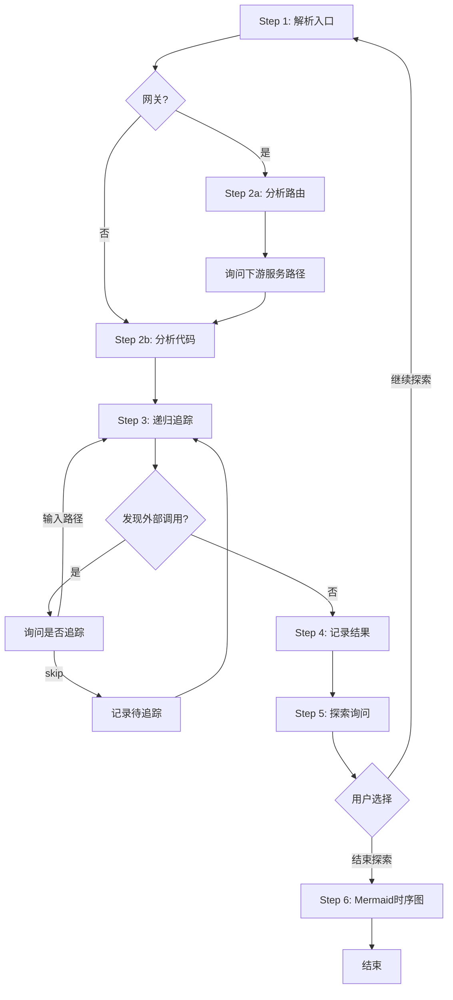
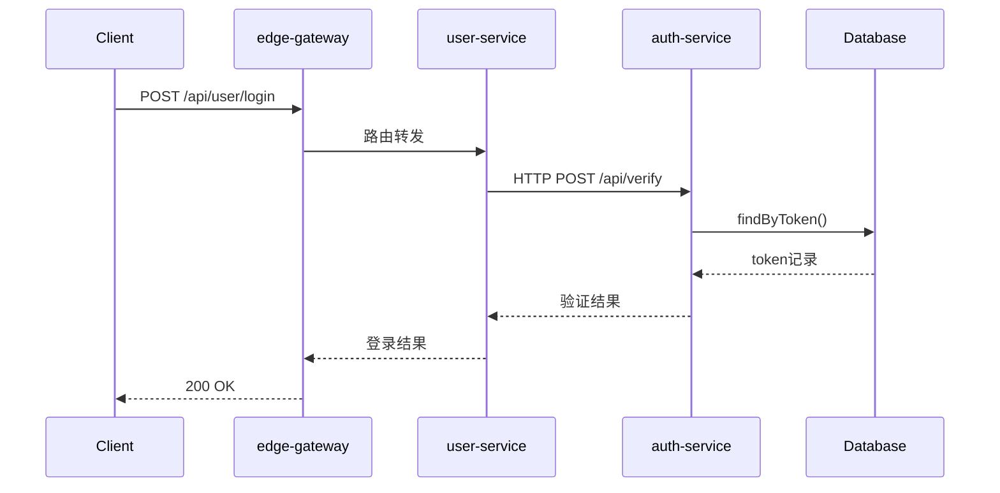

# Flow Trace Skill

AI驱动的微服务调用链分析，支持**业务服务**和**边缘网关**。

## 使用方式

```
/flow-trace <入口点> [选项]
```

### 入口点格式

**业务服务**：

| 格式 | 示例 |
|------|------|
| `服务名:类名.方法名` | `user-service:UserController.login` |
| `服务名:/api路径` | `order-service:/api/orders/create` |
| `服务名:类名` | `payment-service:PaymentService` |

**网关服务**：

| 格式 | 示例 |
|------|------|
| `网关名:gateway` | `api-gateway:gateway` |
| `网关名:/api路径` | `api-gateway:/api/user/login` |

### 选项

| 选项 | 说明 |
|------|------|
| `--depth N` | 追踪深度，默认5 |
| `--output FILE` | 输出文件名 |
| `--gateway-type TYPE` | 网关类型：spring-cloud-gateway/kong/nginx/apisix |

### 示例

```
/flow-trace user-service:UserController.login
/flow-trace order-service:/api/orders --depth 10
/flow-trace api-gateway:gateway
```

---

## 分析流程（Step 1-6）

```
Step 1: 解析入口点 → 定位服务代码目录 → 判断网关/业务服务
Step 2: 分析服务 → 网关模式(分析路由) / 业务服务模式(分析代码)
Step 3: 递归追踪 → 发现外部服务/异步表 → 询问是否继续
Step 4: 记录结果 → JSON格式内部记录
Step 5: 探索询问 → 继续探索(回Step1-3) / 结束探索(进Step6)
Step 6: 生成图表 → 汇总结果 → Mermaid生成时序图(默认)
```

### 流程循环图



**关键点**：每次分析完成必须回到 Step 5 询问，直到用户选择"结束探索"才进入 Step 6 生成时序图。

---

## 关键行为规则

### 必须执行的询问点

| 时机 | 询问内容 | 下一步 |
|------|----------|--------|
| 发现外部服务(HTTP/RPC) | 是否继续追踪？ | 输入路径→Step3；skip→记录待追踪；quit→结束 |
| 发现嵌套异步表 | 是否继续分析下游？ | 输入路径→Step3；skip→记录待追踪；quit→结束 |
| 单个服务分析完成 | 是否继续探索？(Step5) | 继续→回Step1-3；结束→Step6 |

### 探索询问格式(Step 5)

```
════════════════════════════════════════════════════════
是否继续探索？
════════════════════════════════════════════════════════

本次分析发现的路径:
• xxx-service → yyy-service (调用类型)

本次发现但未追踪的服务:
• zzz-service (用户选择skip)

探索选项:
1. 分析其他入口点
2. 深入分析某个节点
3. 追踪未分析的下游服务
4. 结束探索，生成图表
5. 仅输出JSON，不生成图表

请选择 (1/2/3/4/5):
```

---

## 表驱动异步流程

**识别信号**：
- 状态字段：`status`/`state`/`process_status`
- 状态流转方法：`findByStatus`/`updateStatus`
- 触发机制：`@Scheduled`定时任务/事件监听

**发现时询问**：
```
检测到表驱动异步流程:
表名: xxx_task
状态字段: status

请确认:
1. 下游流程是什么服务？
2. 触发机制是什么？
```

**分析下游时继续识别**：外部服务调用 → 询问是否追踪；嵌套异步表 → 询问是否分析。

---

## Step 6: 生成图表

用户选择"结束探索，生成图表"后执行：

### 图表类型选择

```
生成图表类型:
1. 时序图 (sequence) ← 推荐，展示调用顺序和交互
2. 流程图 (flowchart) - 展示调用层级关系
3. 两者都生成

请选择 (1/2/3): 
```

**默认推荐时序图**，因为：
- 更直观展示调用顺序
- 适合分析单个或多个API的完整流程
- 易于理解服务间的交互关系

### 生成方式

**默认用 Mermaid 生成**（无需额外工具，Markdown可直接渲染）：



**如果用户安装了 DrawIO 桌面应用**，可询问是否生成 .drawio 文件：

```
是否安装了 DrawIO 桌面应用? (y/n): y

将同时生成:
- Mermaid 格式（Markdown渲染）
- .drawio 文件（DrawIO编辑）

是否生成 .drawio 文件? (y/n):
```

### 输出位置

生成图表后输出到：
- Mermaid：直接在对话中输出
- .drawio 文件：保存到用户指定的目录或当前工作目录

---

## 详细文档

- [网关分析详细说明](references/gateway-analysis.md) - 网关类型、配置解析、路由规则
- [代码识别模式](references/code-patterns.md) - HTTP/RPC/MQ/DB调用识别、表驱动异步流程
- [输出格式详细说明](references/output-format.md) - JSON结构、节点类型、时序图数据
- [图表生成详细说明](references/diagram-generation.md) - Mermaid模板、DrawIO调用、样式
- [示例对话](references/examples.md) - 标准同步调用、网关分析、多层异步流程

---

## 注意事项

1. **需要代码访问权限**：AI需要能读取服务的源代码
2. **最大深度**：默认5层，避免无限递归
3. **已访问检查**：避免循环调用导致的无限分析
4. **强制探索询问**：每次分析完成后必须回到Step5询问
5. **探索后生成图表**：只有用户选择"结束探索"后才进入Step6
6. **异步流程递归**：发现外部服务或嵌套异步表必须询问是否继续

---

*此skill让AI自己分析代码，输出结构化JSON，调用drawio生成流程图。详细说明见 references/ 目录。*