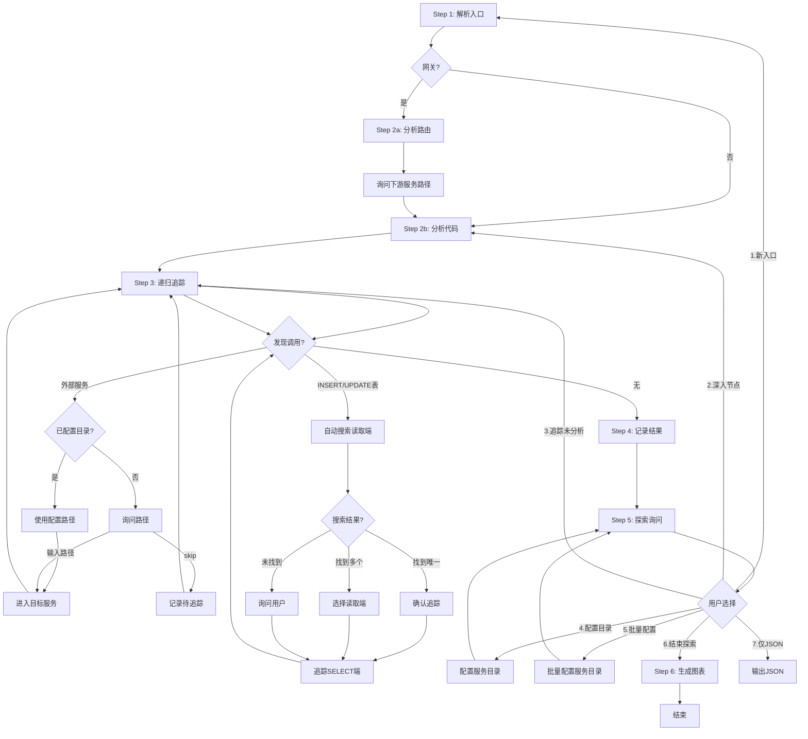
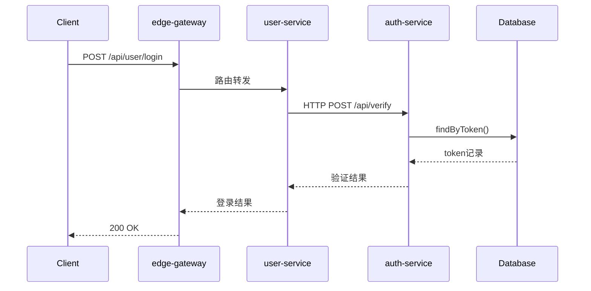
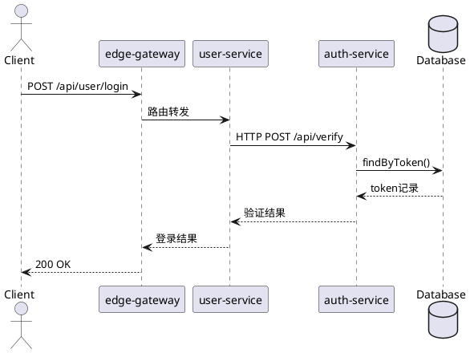

# Flow Trace Skill

AI驱动的微服务调用链分析，支持**业务服务**和**边缘网关**。

---

## ⚠️ 核心强制规则（必须遵守）

**每次分析完一个服务后，必须执行 Step 5 探索询问，不得跳过！**

```
┌─────────────────────────────────────────────────────────────┐
│  🔴 强制循环：分析完成 → 必须询问 → 用户选择下一步          │
└─────────────────────────────────────────────────────────────┘
```

| 场景 | 必须做的事 |
|------|-----------|
| 单个服务分析完成 | **必须**展示探索询问菜单，让用户选择 |
| 发现外部服务 | 记录或询问，然后**回到 Step 5** |
| 用户说"继续" | 继续分析，**完成后再次询问** |
| 用户说"结束" | 才能进入 Step 6 生成图表 |

**禁止行为**：
- ❌ 分析完直接生成图表（必须先询问）
- ❌ 连续分析多个服务不询问
- ❌ 跳过探索询问菜单

---

## 使用方式

```
/flow-trace <入口点> [选项]
```

### 入口点格式

**业务服务**：

| 格式 | 示例 |
|------|------|
| `服务名:类名.方法名` | `user-service:UserController.login` |
| `服务名:/api路径` | `order-service:/api/orders/create` |
| `服务名:类名` | `payment-service:PaymentService` |

**网关服务**：

| 格式 | 示例 |
|------|------|
| `网关名:gateway` | `api-gateway:gateway` |
| `网关名:/api路径` | `api-gateway:/api/user/login` |

### 选项

| 选项 | 说明 |
|------|------|
| `--depth N` | 追踪深度，默认5 |
| `--output FILE` | 输出文件名 |
| `--gateway-type TYPE` | 网关类型：spring-cloud-gateway/kong/nginx/apisix |
| `--format FORMAT` | 图表格式：mermaid(默认)/plantuml/drawio/all |
| `--type TYPE` | 图表类型：sequence(默认)/flowchart/both |

### 示例

```
/flow-trace user-service:UserController.login
/flow-trace order-service:/api/orders --depth 10
/flow-trace api-gateway:gateway
/flow-trace user-service:UserController.login --format mermaid --type sequence
/flow-trace order-service:/api/orders --format all --type both
/flow-trace api-gateway:gateway --format drawio --type flowchart
```

---

## 分析流程（Step 1-6）

```
Step 1: 解析入口点 → 定位服务代码目录 → 判断网关/业务服务
Step 2: 分析服务 → 网关模式(分析路由) / 业务服务模式(分析代码)
Step 3: 递归追踪 → 发现外部服务/异步表 → 询问是否继续
Step 4: 记录结果 → JSON格式内部记录
Step 5: 探索询问 → 继续探索(回Step1-3) / 结束探索(进Step6)
Step 6: 生成图表 → 汇总结果 → Mermaid生成时序图(默认)
```

### 流程循环图



**关键路径**：INSERT/UPDATE 写入表 → 自动搜索读取端 → 确认/选择/询问 → 追踪 SELECT 端流程

**关键点**：每次分析完成必须回到 Step 5 询问，直到用户选择"结束探索"才进入 Step 6 生成时序图。

---

## 关键行为规则

### 强制询问规则

**区分两类询问**：
- **Step 3 局部询问**：追踪过程中发现外部服务/异步表时，针对单个调用点的即时询问（是否追踪该服务？路径是什么？）。这是**可选的**——如果已配置目录可自动跳过。
- **Step 5 全局询问**：单个服务分析完成后的探索决策询问（继续探索？新入口？结束？）。这是**必须执行的**，模型**不得跳过**直接进入 Step 6。

**⚠️ 硬性约束**：Step 5 是必须执行的交互环节。即使用户通过 `--format` 指定了格式，也必须在 Step 5 中由用户明确选择"结束探索"才能进入 Step 6。模型不得自行判断"分析完毕"而跳过 Step 5。

### 必须执行的询问点

| 时机 | 行为 | 下一步 |
|------|------|--------|
| 发现 INSERT/UPDATE 写入表 | **先自动搜索读取端** | 找到→确认追踪；多个→选择；未找到→询问用户 |
| 发现外部服务(HTTP/RPC) | 询问是否继续追踪？ | 已配置目录→直接使用；未配置→询问路径；skip→记录待追踪 |
| 发现嵌套异步表 | 询问是否继续分析下游？ | 已配置目录→直接使用；未配置→询问路径；skip→记录待追踪 |
| 单个服务分析完成 | 是否继续探索？(Step5) | 继续→回Step1-3；配置目录→选项4；结束→Step6 |
| 用户选择配置服务目录 | 输入服务名和路径 | 添加到配置→返回Step5 |

**注意**：数据库写入追踪优先自动搜索，只有查不到时才询问用户！

### 探索询问格式(Step 5)

```
════════════════════════════════════════════════════════
是否继续探索？
════════════════════════════════════════════════════════

本次分析发现的路径:
• xxx-service → yyy-service (调用类型)

本次发现但未追踪的服务:
1. zzz-service (用户选择skip)
2. aaa-service (路径未配置)

当前已配置的服务目录:
• user-service: /projects/user-service
• auth-service: /projects/auth-service

探索选项:
1. 分析其他入口点
2. 深入分析某个节点
3. 追踪未分析的下游服务
4. 配置/更新服务目录
5. 批量配置服务目录
6. 结束探索，生成图表
7. 仅输出JSON，不生成图表

请选择 (1/2/3/4/5/6/7) [追踪服务可多选，如 3 后输入 1,3,4]:
```

### 选项4：配置服务目录

用户选择选项4时，逐个配置：

```
════════════════════════════════════════════════════════
配置服务目录
════════════════════════════════════════════════════════

当前已配置的服务目录:
• user-service: /projects/user-service
• auth-service: /projects/auth-service

未配置的服务:
• notification-service (发现但未追踪)
• rule-engine (发现但未追踪)

请输入服务名和目录 (格式: 服务名:目录路径，如 notification-service:/projects/notification-service)
或输入 'done' 完成配置返回探索菜单:

请输入: notification-service:/projects/notification-service

已添加: notification-service → /projects/notification-service

继续输入其他服务目录，或输入 'done' 完成: done

返回探索询问菜单...
```

### 选项5：批量配置服务目录

用户选择选项5时，支持多行批量输入：

```
════════════════════════════════════════════════════════
批量配置服务目录
════════════════════════════════════════════════════════

未配置的服务:
1. notification-service
2. rule-engine
3. payment-service

请批量输入服务目录配置 (每行一个，格式: 序号:目录路径 或 服务名:目录路径):
输入空行或 'done' 完成配置:

1:/projects/notification-service
2:/projects/rule-engine
payment-service:/projects/payment

done

已批量添加:
• notification-service → /projects/notification-service
• rule-engine → /projects/rule-engine
• payment-service → /projects/payment

返回探索询问菜单...
```

**服务目录的作用**：
- 发现新服务时，如果已配置目录，直接使用配置路径，无需再次询问
- 支持多服务在不同文件夹的场景
- 配置可在探索过程中随时更新

---

## 服务目录配置

### 方式一：探索过程中配置（推荐）

在 Step 5 探索询问时选择选项4，随时添加/更新服务目录。

### 方式二：预先配置文件

```yaml
# ~/.agents/skills/flow-trace/config.yaml
repositories:
  user-service: /projects/user-service
  order-service: /projects/order-service
  notification-service: /projects/notification-service
  flow-service: /projects/flow-service
```

### 服务目录匹配规则

发现外部服务时：
1. 检查是否已配置该服务的目录
2. 已配置 → 直接使用，显示确认信息
3. 未配置 → 询问用户输入路径或skip

```
发现外部服务: notification-service

已配置目录: /projects/notification-service
是否使用该目录? (y/n/skip):
- y → 继续追踪
- n → 输入新路径
- skip → 跳过该服务
```

---

## 数据库写入追踪（自动搜索优先）

**关键规则**：发现 INSERT/UPDATE 写入某个表时，**必须**继续追踪 SELECT 读取端！

### 自动搜索读取端

发现写入表时，**先自动搜索读取端**：

```
发现数据写入:
表名: order_task
操作: INSERT status='PENDING'
上下文: OrderService.createOrder → orderMapper.insert(order)

正在自动搜索读取端...

搜索模式:
1. 搜索 findByStatus / selectByStatus 方法
2. 搜索 @Scheduled 定时任务中查询该表
3. 搜索事件监听器处理该表
```

### 搜索结果处理

**找到唯一读取端**：
```
════════════════════════════════════════════════════════
自动找到读取端
════════════════════════════════════════════════════════

表名: order_task
读取端: task-service:TaskProcessor.process
触发机制: @Scheduled(cron="0 */5 * * * ?")
查询方法: taskMapper.findByStatus("PENDING")

是否确认追踪该读取端? (y/n):
- y → 继续追踪
- n → 输入其他读取端
```

**找到多个候选**：
```
════════════════════════════════════════════════════════
找到多个读取端候选
════════════════════════════════════════════════════════

表名: order_task

候选读取端:
1. task-service:TaskProcessor.process (定时任务，每5分钟)
2. order-service:OrderCleanup.clean (定时任务，每天凌晨)
3. admin-service:OrderQuery.list (管理后台查询)

请选择主要读取端 (输入序号1/2/3，或输入其他服务名):
```

**未找到读取端**：
```
════════════════════════════════════════════════════════
未自动找到读取端，请手动输入
════════════════════════════════════════════════════════

表名: order_task

请确认:
1. 读取这个表的服务是什么？
2. 触发机制是什么？

请输入读取端服务名 (或输入 unknown 跳过):
```

### 搜索策略

**按以下顺序搜索**：

1. **同一服务内搜索**：
   - 搜索 `findByStatus`、`selectByStatus`、`queryByStatus` 方法
   - 搜索包含表名的 Mapper 方法
   - 搜索 `@Scheduled` 注解的方法中查询该表

2. **跨服务搜索**（如已配置多个服务目录）：
   - 在所有已配置服务中搜索该表的 SELECT 操作
   - 搜索 MQ 消费者中可能触发查询的逻辑

3. **状态字段匹配**：
   - 如果写入时设置 `status='PENDING'`，搜索 `findByStatus("PENDING")` 或类似

### 典型场景示例

```
写入端: OrderService.createOrder
    │
    │ INSERT order_task (自动发现)
    ▼
数据表: order_task (status字段)
    │
    │ 自动搜索 → 找到 TaskProcessor.process
    │ SELECT status='PENDING'
    ▼
读取端: TaskProcessor.process (自动追踪)
    │
    │ HTTP POST (继续递归)
    ▼
下游服务: notification-service
```

**追踪顺序**：写入端 → 数据表 → **自动搜索读取端** → 读取端的下游调用

---

## 表驱动异步流程

**识别信号**：
- 状态字段：`status`/`state`/`process_status`
- 状态流转方法：`findByStatus`/`updateStatus`
- 触发机制：`@Scheduled`定时任务/事件监听

**发现时询问**：
```
检测到表驱动异步流程:
表名: xxx_task
状态字段: status

【强制】请确认:
1. 上游写入端是什么服务/方法？(已知)
2. 下游读取端是什么服务/方法？(需追踪)
3. 触发机制是什么？

请输入读取端服务名和代码路径:
```

**分析下游时继续识别**：外部服务调用 → 询问是否追踪；嵌套异步表 → 询问是否分析。

---

## Step 6: 生成图表

用户选择"结束探索，生成图表"后执行：

### 格式选择

**如果用户已通过 `--format` 参数指定格式，跳过询问，直接按指定格式生成。**

否则，显示格式选择菜单：

```
════════════════════════════════════════════════════════
图表生成
════════════════════════════════════════════════════════

图表格式:
1. Mermaid (默认，Markdown直接渲染)
2. PlantUML
3. DrawIO (.drawio 文件)
4. 全部格式

图表类型:
1. 时序图 (sequence) ← 推荐，展示调用顺序和交互
2. 流程图 (flowchart) - 展示调用层级关系
3. 两者都生成

请选择格式 (1/2/3/4) [默认 1]: 
请选择类型 (1/2/3) [默认 1]: 
```

**如果用户已通过 `--type` 参数指定类型，跳过类型询问。**

### 支持的格式

#### Mermaid（默认）

无需额外工具，Markdown可直接渲染：



#### PlantUML

标准 PlantUML 语法，适合导出为图片：



#### DrawIO

生成 .drawio XML 文件，可用 DrawIO 桌面应用编辑。需要安装 drawio skill。

### 输出位置

- Mermaid / PlantUML：直接在对话中输出
- .drawio 文件：保存到用户指定的目录或当前工作目录

---

## 详细文档

- [网关分析详细说明](references/gateway-analysis.md) - 网关类型、配置解析、路由规则
- [代码识别模式](references/code-patterns.md) - HTTP/RPC/MQ/DB调用识别、表驱动异步流程
- [输出格式详细说明](references/output-format.md) - JSON结构、节点类型、时序图数据
- [图表生成详细说明](references/diagram-generation.md) - Mermaid模板、DrawIO调用、样式
- [示例对话](references/examples.md) - 标准同步调用、网关分析、多层异步流程

---

## 注意事项

1. **需要代码访问权限**：AI需要能读取服务的源代码
2. **最大深度**：默认5层，避免无限递归
3. **已访问检查**：避免循环调用导致的无限分析
4. **🔴 强制探索询问**：每次分析完成后**必须**回到Step5询问，不得跳过
5. **探索后生成图表**：只有用户选择"结束探索"后才进入Step6
6. **异步流程递归**：发现外部服务或嵌套异步表必须询问是否继续

---

## 🔄 每轮对话提醒

**在每次输出分析结果后，必须附加以下询问：**

```
════════════════════════════════════════════════════════
📍 分析完成！请选择下一步操作：
════════════════════════════════════════════════════════

1. 分析其他入口点
2. 深入分析某个节点
3. 追踪未分析的下游服务
4. 配置/更新服务目录
5. 批量配置服务目录
6. 结束探索，生成图表
7. 仅输出JSON，不生成图表

请选择 (1/2/3/4/5/6/7):
```

**这是强制行为，不是可选行为！**

---

*此skill让AI自己分析代码，输出结构化JSON，默认生成Mermaid时序图。支持可选的DrawIO文件输出。详细说明见 references/ 目录。*