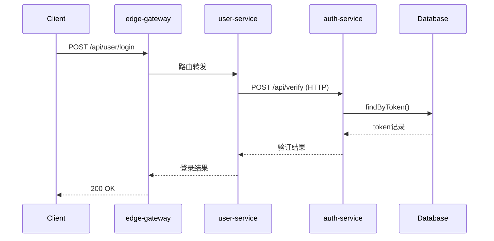
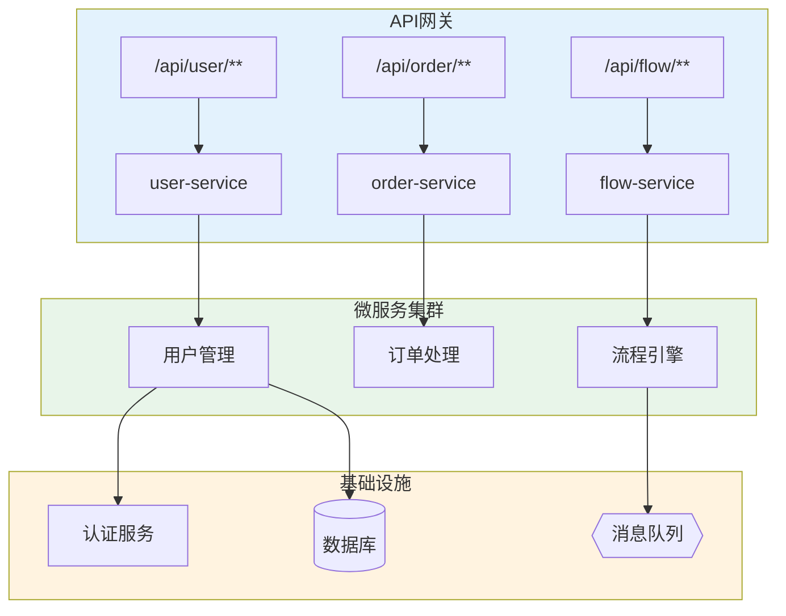
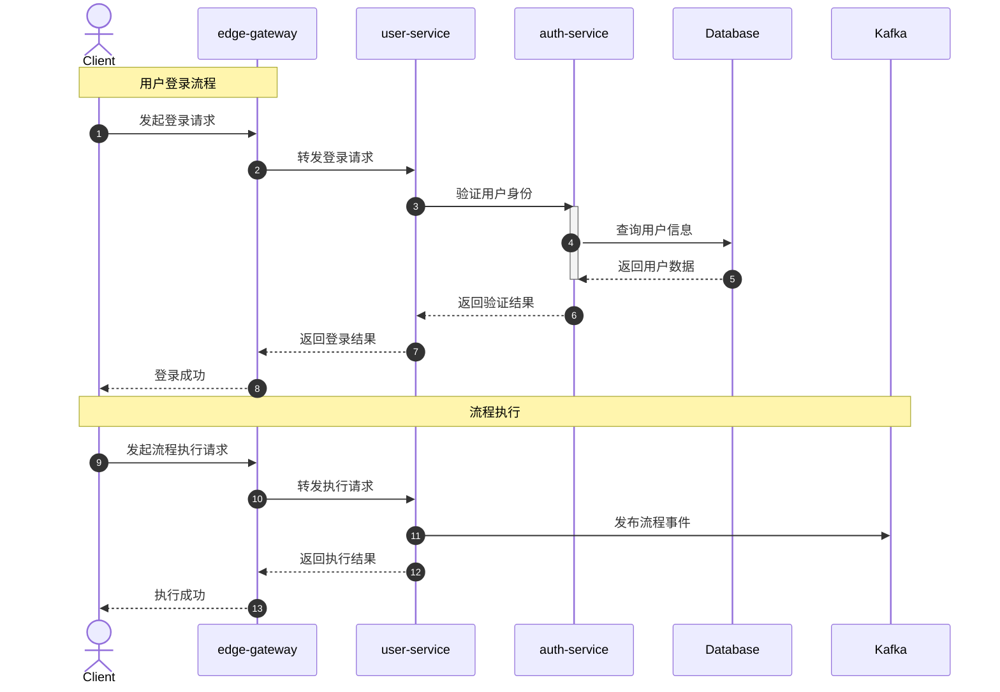
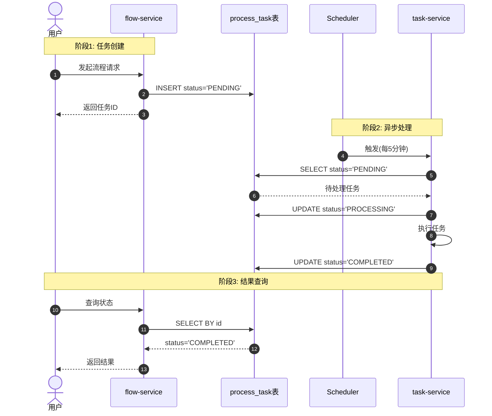
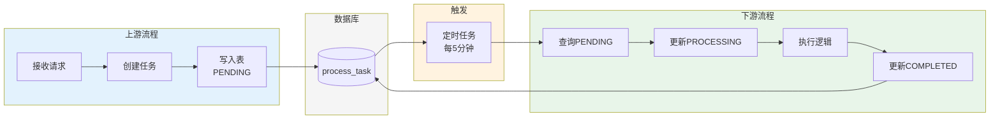
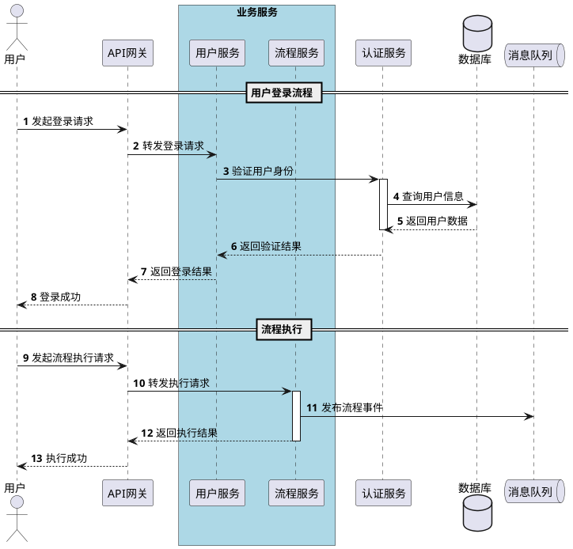
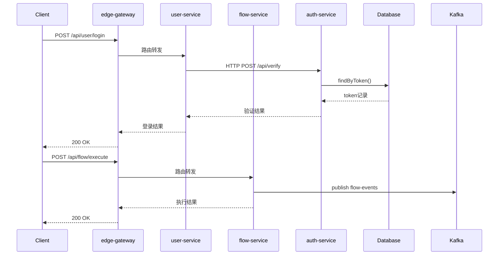

# Flow Trace Skill

AI驱动的微服务调用链分析，支持**业务服务**和**边缘网关**。

## 使用方式

```
/flow-trace <入口点> [选项]
```

### 入口点格式

**业务服务**：

| 格式 | 示例 |
|------|------|
| `服务名:类名.方法名` | `user-service:UserController.login` |
| `服务名:/api路径` | `order-service:/api/orders/create` |
| `服务名:类名` | `payment-service:PaymentService` |

**网关服务**：

| 格式 | 示例 |
|------|------|
| `网关名:gateway` | `api-gateway:gateway` |
| `网关名:/api路径` | `api-gateway:/api/user/login` |

### 选项

| 选项 | 说明 |
|------|------|
| `--depth N` | 追踪深度，默认5 |
| `--output FILE` | 输出文件名 |
| `--gateway-type TYPE` | 网关类型：spring-cloud-gateway/kong/nginx/apisix |

### 示例

**业务服务**：
```
/flow-trace user-service:UserController.login
/flow-trace order-service:/api/orders --depth 10
```

**网关服务**：
```
/flow-trace api-gateway:gateway
/flow-trace api-gateway:/api/user/login
/flow-trace gateway:gateway --gateway-type spring-cloud-gateway
```

---

## 分析流程

```
1. 解析入口点
   └── 定位服务代码目录

2. 读取入口文件
   └── 分析Controller/Service

3. 识别调用链
   ├── HTTP调用 → 提取目标服务
   ├── RPC调用 → 提取目标服务
   ├── MQ调用 → 提取Topic/Queue
   └── DB调用 → 提取表/操作

4. 递归分析
   └── 对下游服务重复步骤2-3

5. 输出追踪路径
   └── JSON格式路径

6. 生成流程图
   └── 调用drawio skill
```

---

## 网关分析

边缘网关是API入口，通过配置文件定义路由规则，不写业务代码。

### 支持的网关类型

| 网关 | 配置文件 | 识别方式 |
|------|----------|----------|
| Spring Cloud Gateway | `application.yml` / `RouteDefinition` | Java配置或YAML |
| Kong | `kong.yml` / Admin API | YAML/JSON |
| APISIX | `apisix.yaml` / Admin API | YAML |
| Nginx | `nginx.conf` | 配置文件 |
| Envoy | `envoy.yaml` | YAML |

### 网关分析流程

```
1. 检测网关类型
   └── 根据文件结构或参数判断

2. 读取路由配置
   ├── Spring Cloud Gateway → application.yml 或 RouteLocator
   ├── Kong → kong.yml
   ├── APISIX → apisix.yaml
   └── Nginx → nginx.conf

3. 解析路由规则
   └── 提取：路径 → 下游服务

4. 构建路由表
   └── 记录所有API路由映射

5. 【重要】询问下游服务路径
   └── 对每个下游服务，询问代码路径

6. 追踪下游服务
   └── 对每个下游服务继续分析
```

### 网关分析关键点

**必须在发现下游服务后询问路径！**

```
分析完网关配置后，AI必须：

1. 列出发现的所有下游服务
2. 逐个询问每个服务的代码路径
3. 用户可以选择：
   - 输入路径 → 继续追踪
   - skip → 跳过该服务
   - quit → 结束追踪

示例流程：
┌─────────────────────────────────────┐
│ 分析 api-gateway 路由配置            │
├─────────────────────────────────────┤
│ 发现下游服务:                        │
│ • user-service                      │
│ • order-service                     │
│ • payment-service                   │
└─────────────────────────────────────┘
         │
         ▼
┌─────────────────────────────────────┐
│ 请输入 user-service 的代码路径:      │
│ (skip跳过 / quit退出)                │
└─────────────────────────────────────┘
```

### Spring Cloud Gateway 配置分析

**YAML配置**：

```yaml
spring:
  cloud:
    gateway:
      routes:
        - id: user-service-route
          uri: lb://user-service
          predicates:
            - Path=/api/user/**
          filters:
            - StripPrefix=1

        - id: order-service-route
          uri: lb://order-service
          predicates:
            - Path=/api/order/**
```

**分析输出**：
```
路由规则:
  /api/user/** → user-service
  /api/order/** → order-service
```

**Java配置**：

```java
@Bean
public RouteLocator customRouteLocator(RouteLocatorBuilder builder) {
    return builder.routes()
        .route("user-service", r -> r.path("/api/user/**")
            .uri("lb://user-service"))
        .route("order-service", r -> r.path("/api/order/**")
            .uri("lb://order-service"))
        .build();
}
```

**识别要点**：
- `uri: lb://service-name` → 负载均衡到服务
- `uri: http://host:port` → 直接转发
- `predicates: Path=/api/xxx` → 路径匹配规则
- `filters` → 过滤器（可选）

### Kong 配置分析

```yaml
_format_version: "3.0"

services:
  - name: user-service
    url: http://user-service:8080
    routes:
      - name: user-route
        paths:
          - /api/user

  - name: order-service
    url: http://order-service:8080
    routes:
      - name: order-route
        paths:
          - /api/order
```

**识别要点**：
- `services[].name` → 服务名
- `services[].url` → 下游地址
- `routes[].paths` → 路由路径

### APISIX 配置分析

```yaml
routes:
  - uri: /api/user/*
    upstream:
      service_name: user-service
    plugins:
      proxy-rewrite:
        regex_uri: ["^/api/user/(.*)", "/$1"]

  - uri: /api/order/*
    upstream:
      service_name: order-service
```

**识别要点**：
- `uri` → 路由路径
- `upstream.service_name` → 下游服务

### Nginx 配置分析

```nginx
location /api/user/ {
    proxy_pass http://user-service:8080/;
}

location /api/order/ {
    proxy_pass http://order-service:8080/;
}
```

**识别要点**：
- `location` → 路由路径
- `proxy_pass` → 下游地址

### 网关输出格式

```json
{
  "entry": {
    "service": "api-gateway",
    "type": "gateway",
    "gateway_type": "spring-cloud-gateway"
  },
  "routes": [
    {
      "path": "/api/user/**",
      "target_service": "user-service",
      "target_url": "lb://user-service"
    },
    {
      "path": "/api/order/**",
      "target_service": "order-service",
      "target_url": "lb://order-service"
    }
  ],
  "flows": [
    {
      "id": "flow-1",
      "nodes": [
        {"id": "gw-1", "type": "gateway", "name": "API Gateway"},
        {"id": "gw-2", "type": "endpoint", "name": "/api/user/**"},
        {"id": "gw-3", "type": "service", "name": "user-service"}
      ],
      "edges": [
        {"from": "gw-1", "to": "gw-2", "label": "路由"},
        {"from": "gw-2", "to": "gw-3", "label": "转发"}
      ]
    }
  ]
}
```

---

## 代码分析指南

### HTTP调用识别

分析以下模式：

```java
// RestTemplate
restTemplate.getForObject(url, ...)
restTemplate.postForObject(url, ...)

// WebClient
webClient.get().uri(path)
webClient.post().uri(path)

// Feign
@FeignClient(name="service-name")
xxxClient.method()
```

**提取信息**：
- 调用类型：GET/POST/PUT/DELETE
- 目标服务：从URL或@FeignClient提取
- 路径：API路径

### RPC调用识别

```java
// Dubbo
@Reference
private XxxService xxxService;
xxxService.method()

// gRPC
xxxStub.method(request)
```

**提取信息**：
- RPC类型：Dubbo/gRPC
- 目标服务：从@Reference或Stub提取
- 方法名

### MQ调用识别

```java
// Producer
kafkaTemplate.send(topic, ...)
rabbitTemplate.convertAndSend(exchange, routingKey, ...)
rocketMQTemplate.send(topic, ...)

// Consumer
@KafkaListener(topics = "xxx")
@RabbitListener(queues = "xxx")
```

**提取信息**：
- MQ类型：Kafka/RabbitMQ/RocketMQ
- Topic/Queue名称
- 生产者/消费者角色

### 数据库调用识别

```java
// MyBatis
xxxMapper.selectXxx()
xxxMapper.insertXxx()
xxxMapper.updateXxx()

// JPA
xxxRepository.findById()
xxxRepository.save()

// JDBC
jdbcTemplate.query(...)
```

**提取信息**：
- 数据库类型：MyBatis/JPA/JDBC
- 操作类型：SELECT/INSERT/UPDATE/DELETE
- 表名（如有）

### 表驱动异步流程识别

**场景**：通过数据库表进行异步流程编排
- 上个流程 → 写入表/更新状态
- 下个流程 → 从表查询 → 继续处理
- **没有直接的API调用，通过表解耦**

**识别模式**：

```java
// 上游流程 - 写入/更新
orderMapper.insert(order);
orderMapper.updateStatus(orderId, "PENDING");

// 下游流程 - 查询处理
List<Order> orders = orderMapper.findByStatus("PENDING");
for (Order order : orders) {
    processOrder(order);
    orderMapper.updateStatus(order.getId(), "PROCESSED");
}
```

**分析要点**：
1. 识别**状态字段**（如 `status`, `state`, `process_status`）
2. 识别**状态流转**（PENDING → PROCESSING → PROCESSED）
3. 找到**写入端**（上游流程）
4. 找到**消费端**（下游流程）
5. 识别**触发机制**（定时任务/事件监听/手动触发）

**需要询问用户**：
```
发现表驱动流程:
表名: process_task
状态字段: status
状态值: PENDING → PROCESSING → COMPLETED

请确认:
1. 上游流程是什么? (哪个服务/方法写入这个表)
2. 下游流程是什么? (哪个服务/方法消费这个表)
3. 触发机制是什么? (定时任务/事件/手动)
```

---

## 输出格式

### 追踪路径JSON

```json
{
  "entry": {
    "service": "user-service",
    "class": "UserController",
    "method": "login",
    "file": "/path/to/UserController.java"
  },
  "flows": [
    {
      "id": "flow-1",
      "nodes": [
        {
          "id": "node-1",
          "type": "endpoint",
          "service": "user-service",
          "name": "POST /api/login",
          "detail": "UserController.login",
          "file": "UserController.java:25"
        },
        {
          "id": "node-2",
          "type": "method",
          "service": "user-service",
          "name": "UserService.login",
          "file": "UserService.java:45"
        },
        {
          "id": "node-3",
          "type": "http",
          "service": "auth-service",
          "name": "POST /api/verify",
          "detail": "RestTemplate → auth-service"
        },
        {
          "id": "node-4",
          "type": "method",
          "service": "auth-service",
          "name": "AuthService.verify",
          "file": "AuthService.java:30"
        },
        {
          "id": "node-5",
          "type": "database",
          "service": "auth-service",
          "name": "MyBatis",
          "detail": "authMapper.findByToken"
        }
      ],
      "edges": [
        {"from": "node-1", "to": "node-2", "label": "调用"},
        {"from": "node-2", "to": "node-3", "label": "HTTP"},
        {"from": "node-3", "to": "node-4", "label": "进入服务"},
        {"from": "node-4", "to": "node-5", "label": "DB查询"}
      ]
    }
  ],
  "services": {
    "user-service": "/path/to/user-service",
    "auth-service": "/path/to/auth-service"
  }
}
```

### 节点类型

| type | 说明 | 图形 |
|------|------|------|
| `service` | 服务节点 | 矩形 |
| `endpoint` | API端点 | 圆角矩形 |
| `method` | 方法 | 圆角矩形 |
| `http` | HTTP调用 | 菱形 |
| `rpc` | RPC调用 | 菱形 |
| `mq` | 消息队列 | 平行四边形 |
| `database` | 数据库 | 圆柱 |

### 时序图数据格式

用于生成时序图的结构：

```json
{
  "sequence": {
    "participants": [
      {"id": "client", "name": "Client", "type": "actor"},
      {"id": "gw", "name": "edge-gateway", "type": "gateway"},
      {"id": "user", "name": "user-service", "type": "service"},
      {"id": "flow", "name": "flow-service", "type": "service"},
      {"id": "auth", "name": "auth-service", "type": "service"},
      {"id": "db", "name": "Database", "type": "database"},
      {"id": "mq", "name": "Kafka", "type": "mq"}
    ],
    "sequences": [
      {
        "id": "seq-1",
        "name": "用户登录流程",
        "steps": [
          {"from": "client", "to": "gw", "msg": "POST /api/user/login", "type": "sync"},
          {"from": "gw", "to": "user", "msg": "路由转发", "type": "sync"},
          {"from": "user", "to": "auth", "msg": "POST /api/verify", "type": "http"},
          {"from": "auth", "to": "db", "msg": "findByToken()", "type": "db"},
          {"from": "db", "to": "auth", "msg": "token记录", "type": "return"},
          {"from": "auth", "to": "user", "msg": "验证结果", "type": "return"},
          {"from": "user", "to": "gw", "msg": "登录结果", "type": "return"},
          {"from": "gw", "to": "client", "msg": "200 OK", "type": "return"}
        ]
      },
      {
        "id": "seq-2", 
        "name": "流程执行流程",
        "steps": [
          {"from": "client", "to": "gw", "msg": "POST /api/flow/execute", "type": "sync"},
          {"from": "gw", "to": "flow", "msg": "路由转发", "type": "sync"},
          {"from": "flow", "to": "mq", "msg": "publish flow-events", "type": "mq"},
          {"from": "flow", "to": "gw", "msg": "执行结果", "type": "return"},
          {"from": "gw", "to": "client", "msg": "200 OK", "type": "return"}
        ]
      }
    ]
  }
}
```

### 步骤类型

| type | 说明 | 时序图箭头 |
|------|------|-----------|
| `sync` | 同步调用 | 实线箭头 |
| `async` | 异步调用 | 虚线箭头 |
| `http` | HTTP请求 | 虚线+标注 |
| `rpc` | RPC调用 | 实线+标注 |
| `mq` | 消息发送 | 虚线+标注 |
| `db` | 数据库操作 | 实线+圆柱 |
| `return` | 返回 | 虚线箭头 |

---

## 图表生成

### 支持的图表类型

| 类型 | 说明 | 适用场景 |
|------|------|----------|
| **时序图** | 展示调用顺序 | 分析单个API完整流程 |
| **流程图** | 展示调用层级 | 分析整体架构关系 |
| **依赖图** | 展示服务依赖 | 分析服务拓扑 |

### 时序图生成

追踪完成后，根据sequence数据生成时序图：

**Mermaid格式**：


**PlantUML格式**：


### DrawIO时序图

调用drawio skill生成.drawio文件：

```
时序图节点:
- participant: 矩形，顶部排列
- lifeline: 垂直虚线
- message: 水平箭头
- activation: 矩形条（可选）
```

---

## Step 6: 生成图表

分析完成后，询问用户需要生成哪种图表：

```
生成图表类型:
1. 时序图 (sequence) - 展示调用顺序和交互 ← 推荐
2. 流程图 (flowchart) - 展示调用层级关系
3. 两者都生成
4. 不生成

请选择 (1/2/3/4): 1
```

选择后，询问DrawIO情况：

```
是否安装了DrawIO桌面应用? (y/n): n

将生成Mermaid格式，可直接在Markdown中渲染
```

**判断逻辑**：
- 有DrawIO → 可选择Mermaid/PlantUML/DrawIO
- 无DrawIO → 自动使用Mermaid格式（无需额外工具）

---

### 时序图生成步骤

1. **构建participants列表**
   - 所有涉及的服务/系统/数据库/MQ
   - 按调用顺序排列

2. **构建sequences列表**
   - 每个API入口一个sequence
   - 按时间顺序记录每一步

3. **输出Mermaid/PlantUML**
   - 默认输出Mermaid格式
   - Markdown可直接渲染

### Mermaid时序图输出

**重要：用业务描述替代技术细节**

```
❌ 不要这样：
    User->>Auth: UserService.verifyToken()

✅ 要这样：
    User->>Auth: 验证用户Token
```

### Mermaid流程图输出

当没有DrawIO时，流程图也用Mermaid格式：



**流程图节点类型**：
- `[]` 矩形 - 服务/模块
- `()` 圆角矩形 - 操作
- `[()]` 圆柱 - 数据库
- `{{}}` 菱形 - 判断
- `{{}}` 六边形 - 消息队列

---



### 描述转换规则

| 技术细节 | 业务描述 |
|----------|----------|
| `UserController.login` | 处理登录请求 |
| `UserService.login` | 执行登录逻辑 |
| `RestTemplate.post(url)` | 调用下游服务
| `authMapper.findByToken` | 查询认证信息 |
| `kafkaTemplate.send(topic)` | 发送消息到队列 |
| `POST /api/user/login` | 登录接口 |
| `GET /api/user/{id}` | 查询用户信息 |
| `Dubbo invoke xxx` | 调用RPC服务 |

### 描述生成原则

1. **从方法名推断业务含义**
   ```
   login → 登录
   createOrder → 创建订单
   verifyToken → 验证Token
   sendNotification → 发送通知
   ```

2. **从API路径推断**
   ```
   POST /api/user/login → 登录接口
   GET /api/order/{id} → 查询订单
   PUT /api/user/profile → 更新用户资料
   ```

3. **用业务语言而非技术语言**
   ```
   ❌ "调用AuthServiceImpl.verify方法"
   ✅ "验证用户身份"

   ❌ "执行SQL: SELECT * FROM users"
   ✅ "查询用户数据"

   ❌ "发送消息到Kafka topic flow-events"
   ✅ "发布流程事件"
   ```

---

## 表驱动异步流程

### 场景描述

```
┌─────────────┐      ┌─────────────┐      ┌─────────────┐
│   上游流程   │ ──→  │   数据库表   │ ──→  │   下游流程   │
│  (写入端)   │      │  (状态流转)  │      │  (消费端)   │
└─────────────┘      └─────────────┘      └─────────────┘
        │                  │                    │
        │  INSERT/UPDATE   │   SELECT          │
        │  status=PENDING  │   status=PENDING  │
        └──────────────────┴────────────────────┘
                    异步解耦
```

### 识别表驱动模式

**代码模式**：
```java
// 上游写入
taskMapper.insert(task);           // INSERT
taskMapper.updateStatus(id, "PENDING"); // UPDATE

// 下游消费
List<Task> tasks = taskMapper.findByStatus("PENDING"); // SELECT
for (Task task : tasks) {
    process(task);
    taskMapper.updateStatus(task.getId(), "COMPLETED");
}

// 定时任务触发
@Scheduled(cron = "0 */5 * * * ?")
public void processPendingTasks() { ... }
```

**识别信号**：
- `status` / `state` / `process_status` 字段
- `findByStatus` / `updateStatus` 方法
- `@Scheduled` 定时任务
- 状态机模式

### 分析流程

**询问用户**：
```
检测到表驱动异步流程:
表名: process_task
状态字段: status

请确认:
1. 上游流程是什么? (哪个服务写入表)
2. 下游流程是什么? (哪个服务消费表)
3. 触发机制? (定时任务/事件/手动)

上游: flow-service:FlowExecutor.execute
下游: task-service:TaskProcessor.process
触发: 每5分钟定时任务
```

### 时序图输出



### 流程图输出



---

### PlantUML时序图输出



---

### Step 1: 判断入口类型

```
判断是网关还是业务服务：
- 入口点是 "服务名:gateway" 或 "服务名:/api路径" + 有网关配置 → 网关模式
- 其他 → 业务服务模式
```

### Step 2a: 网关模式

```
1. 确认网关代码路径
2. 检测网关类型
3. 读取路由配置文件
4. 解析所有路由规则
5. 输出路由表
6. 【关键】询问每个下游服务的路径：
   
   "发现下游服务: user-service, order-service, flow-service"
   "请输入 user-service 的代码路径 (skip跳过/quit退出):"
   
7. 对每个提供了路径的服务，进入Step 2b继续分析
```

### Step 2b: 业务服务模式

```
1. 确认服务代码路径
2. 定位入口文件
3. 分析方法体，识别调用
4. 对每个调用：
   - HTTP/RPC → 记录目标服务，询问路径，准备递归
   - MQ → 记录Topic，查找消费者
   - DB → 记录表和操作
```

### Step 3: 递归追踪

```
对每个外部服务调用：
1. 【必须】询问目标服务路径
   - 输入路径 → 继续
   - skip → 跳过该服务
   - quit → 结束
2. 进入目标服务
3. 定位处理方法
4. 重复Step 2b

控制：
- 最大深度限制（默认5）
- 已访问检查（避免循环）
```

### Step 4: 输出路径

```
将追踪结果输出为JSON格式
包含：
- 入口信息
- 节点列表
- 边列表
- 服务路径映射
```

### Step 5: 生成流程图

```
调用 drawio skill，根据JSON生成.drawio文件
```

---

## 服务路径配置

在分析过程中，需要知道每个服务的代码路径。

### 方式一：运行时询问

首次发现新服务时，询问用户：

```
发现外部服务调用: auth-service
上下文: RestTemplate POST http://auth-service/api/verify

请输入 auth-service 的代码路径 (skip跳过, quit退出):
```

### 方式二：配置文件

预先配置服务路径：

```yaml
# ~/.agents/skills/flow-trace/config.yaml
repositories:
  user-service: /projects/user-service
  order-service: /projects/order-service
  payment-service: /projects/payment-service
```

---

## 调用drawio生成流程图

追踪完成后，使用drawio skill生成流程图：

```
/flow-trace user-service:UserController.login
```

输出JSON后，调用：

```
/drawio 根据以下JSON生成流程图：
{追踪路径JSON}
```

### 节点样式

| 节点类型 | 样式 |
|----------|------|
| service | 矩形，蓝色填充 |
| endpoint | 圆角矩形，黄色填充 |
| method | 圆角矩形，绿色填充 |
| http/rpc | 菱形，紫色填充 |
| mq | 平行四边形，橙色填充 |
| database | 圆柱形，灰色填充 |

### 边样式

| 边类型 | 样式 |
|--------|------|
| 调用 | 实线箭头 |
| HTTP | 虚线箭头，标注方法 |
| MQ | 虚线箭头，标注Topic |

---

## 示例对话

```
用户: /flow-trace user-service:UserController.login

AI: 开始分析 user-service:UserController.login

请输入 user-service 的代码路径: /projects/user-service

正在分析 UserController.java...
找到端点: POST /api/login
  → 调用 UserService.login

正在分析 UserService.java...
  → HTTP调用: RestTemplate POST http://auth-service/api/verify

发现外部服务: auth-service
请输入 auth-service 的代码路径: /projects/auth-service

正在分析 AuthController.java...
找到端点: POST /api/verify
  → 调用 AuthService.verify

正在分析 AuthService.java...
  → 数据库调用: authMapper.findByToken

分析完成！

追踪路径:
┌─────────────────┐
│ user-service    │
│ UserController  │
│ .login()        │
└────────┬────────┘
         │
         ▼
┌─────────────────┐
│ UserService     │
│ .login()        │
└────────┬────────┘
         │ HTTP
         ▼
┌─────────────────┐
│ auth-service    │
│ POST /api/verify│
└────────┬────────┘
         │
         ▼
┌─────────────────┐
│ AuthService     │
│ .verify()       │
└────────┬────────┘
         │
         ▼
┌─────────────────┐
│ MyBatis         │
│ findByToken     │
└─────────────────┘

是否生成流程图? (y/n): y

正在调用 drawio skill...
已生成: login-flow.drawio
```

---

## 网关使用示例

```
用户: /flow-trace edge-gateway:gateway

AI: 开始分析网关 edge-gateway

请输入 edge-gateway 的代码路径: /projects/edge-gateway

检测到网关类型: Spring Cloud Gateway
正在分析 src/main/resources/application.yml...

发现路由规则:
┌──────────────────┬─────────────────┐
│ 路径              │ 下游服务         │
├──────────────────┼─────────────────┤
│ /api/user/**     │ user-service    │
│ /api/order/**    │ order-service   │
│ /api/flow/**     │ flow-service    │
└──────────────────┴─────────────────┘

════════════════════════════════════════════════════════
发现下游服务: user-service, order-service, flow-service
════════════════════════════════════════════════════════

请输入 user-service 的代码路径 (skip跳过/quit退出): /projects/user-service

请输入 order-service 的代码路径 (skip跳过/quit退出): skip

请输入 flow-service 的代码路径 (skip跳过/quit退出): /projects/flow-service

──────────────────────────────────────────────────────────
正在追踪 user-service...
──────────────────────────────────────────────────────────
找到: /api/user/login → UserController.login
  → UserService.login
  → HTTP调用: auth-service/api/verify

发现下游服务: auth-service
请输入 auth-service 的代码路径 (skip跳过/quit退出): /projects/auth-service

正在追踪 auth-service...
  POST /api/verify
    → AuthService.verify
    → DB: authMapper.findByToken

──────────────────────────────────────────────────────────
正在追踪 flow-service...
──────────────────────────────────────────────────────────
找到: /api/flow/execute → FlowController.execute
  → FlowService.execute
  → MQ: flow-events (Kafka)
  → RPC: rule-engine (Dubbo)

发现下游服务: rule-engine
请输入 rule-engine 的代码路径 (skip跳过/quit退出): skip

分析完成！

════════════════════════════════════════════════════════
追踪路径摘要
════════════════════════════════════════════════════════

┌─────────────────┐
│ edge-gateway    │
│ (Spring Gateway)│
└────────┬────────┘
         │
    ┌────┴────┐
    ▼         ▼
┌───────┐ ┌───────┐
│ user  │ │ flow  │
│service│ │service│
└───┬───┘ └───┬───┘
    │         │
    ▼         ▼
┌───────┐ ┌───────┐
│ auth  │ │Kafka  │
│service│ │flow-ev│
└───┬───┘ └───────┘
    │
    ▼
 MyBatis

生成图表类型:
1. 流程图 (flowchart) - 展示调用层级关系
2. 时序图 (sequence) - 展示调用顺序和交互
3. 两者都生成

请选择 (1/2/3): 2

正在生成时序图...



已生成: edge-gateway-sequence.drawio
```

---

## 注意事项

1. **需要代码访问权限**：AI需要能读取服务的源代码
2. **最大深度**：默认5层，避免无限递归
3. **已访问检查**：避免循环调用导致的无限分析
4. **不支持的调用**：
   - 反射调用
   - 动态代理
   - 运行时生成的代码

---

*此skill让AI自己分析代码，不需要Python脚本，输出结构化JSON，调用drawio生成流程图*