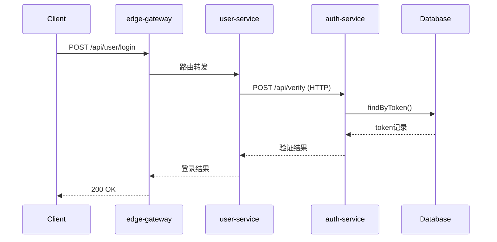
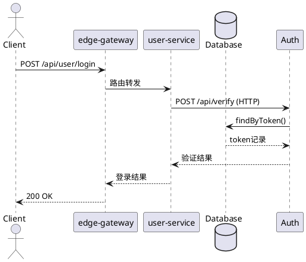
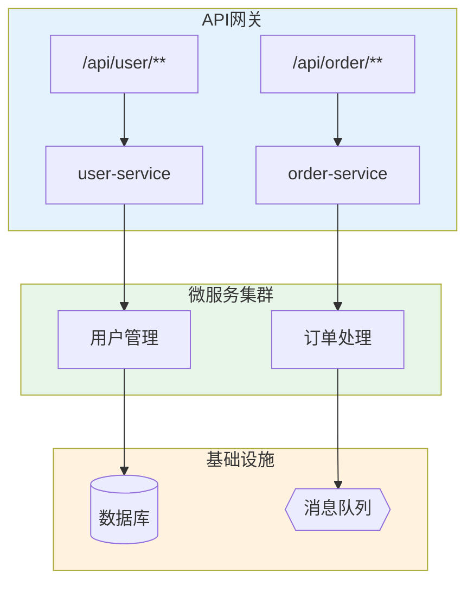
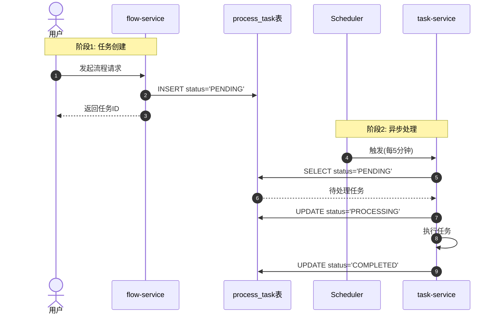
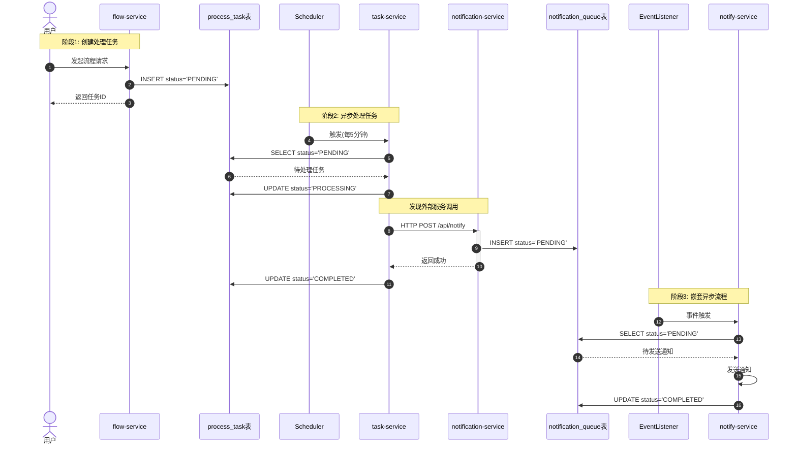
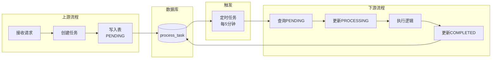
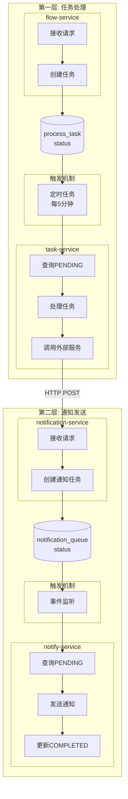

# 图表生成详细说明

## 支持的图表类型

| 类型 | 说明 | 适用场景 |
|------|------|----------|
| **时序图** | 展示调用顺序 | 分析单个API完整流程 |
| **流程图** | 展示调用层级 | 分析整体架构关系 |
| **依赖图** | 展示服务依赖 | 分析服务拓扑 |

## 时序图生成

追踪完成后，根据sequence数据生成时序图：

**Mermaid格式**：


**PlantUML格式**：


## DrawIO时序图

调用drawio skill生成.drawio文件：

```
时序图节点:
- participant: 矩形，顶部排列
- lifeline: 垂直虚线
- message: 水平箭头
- activation: 矩形条（可选）
```

## 流程图生成

**Mermaid流程图**：



**流程图节点类型**：
- `[]` 矩形 - 服务/模块
- `()` 圆角矩形 - 操作
- `[()]` 圆柱 - 数据库
- `{{}}` 菱形 - 判断
- `{{}}` 六边形 - 消息队列

## 描述转换规则

| 技术细节 | 业务描述 |
|----------|----------|
| `UserController.login` | 处理登录请求 |
| `UserService.login` | 执行登录逻辑 |
| `RestTemplate.post(url)` | 调用下游服务 |
| `authMapper.findByToken` | 查询认证信息 |
| `kafkaTemplate.send(topic)` | 发送消息到队列 |
| `POST /api/user/login` | 登录接口 |
| `GET /api/user/{id}` | 查询用户信息 |
| `Dubbo invoke xxx` | 调用RPC服务 |

## 描述生成原则

1. **从方法名推断业务含义**
   ```
   login → 登录
   createOrder → 创建订单
   verifyToken → 验证Token
   sendNotification → 发送通知
   ```

2. **从API路径推断**
   ```
   POST /api/user/login → 登录接口
   GET /api/order/{id} → 查询订单
   PUT /api/user/profile → 更新用户资料
   ```

3. **用业务语言而非技术语言**
   ```
   ❌ "调用AuthServiceImpl.verify方法"
   ✅ "验证用户身份"

   ❌ "执行SQL: SELECT * FROM users"
   ✅ "查询用户数据"

   ❌ "发送消息到Kafka topic flow-events"
   ✅ "发布流程事件"
   ```

## 节点样式

| 节点类型 | 样式 |
|----------|------|
| service | 矩形，蓝色填充 |
| endpoint | 圆角矩形，黄色填充 |
| method | 圆角矩形，绿色填充 |
| http/rpc | 菱形，紫色填充 |
| mq | 平行四边形，橙色填充 |
| database | 圆柱形，灰色填充 |

## 边样式

| 边类型 | 样式 |
|--------|------|
| 调用 | 实线箭头 |
| HTTP | 虚线箭头，标注方法 |
| MQ | 虚线箭头，标注Topic |

## 调用drawio

追踪完成后，使用drawio skill生成流程图：

```
/flow-trace user-service:UserController.login
```

输出JSON后，调用：

```
/drawio 根据以下JSON生成流程图：
{追踪路径JSON}
```

## 时序图模板 - 异步流程

**单层异步表**：



**多层异步表 + 外部服务调用**：



## 流程图模板 - 异步流程

**单层异步表**：



**多层异步表 + 外部服务调用**：

